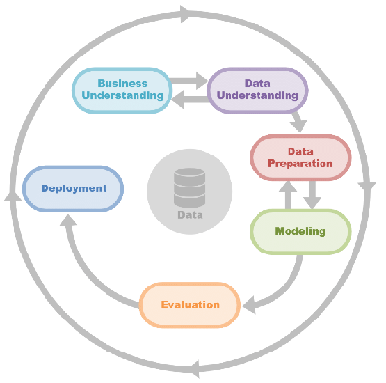
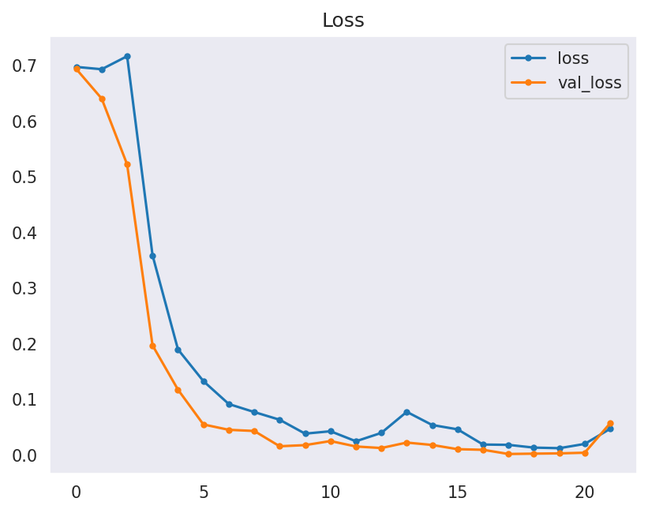

# Cherry Leaves Mildew Detection

The deployed app can be accessed here: [Mildew Detection](https://mildew-detection-bn-f2c139f5e8bd.herokuapp.com/)

## Introduction
Farmy & Foods have a mildew problem. Their cherry plantation operations have a growing powdery mildew issue. Powdery mildew, a fungal disease that affects many plant species, typically starts off as small white circular spots on the surface of leaves, and as the mildew progresses the spots may expand to cover the entire surface of each leaf. Infected leaves may become distorted, curl and fall from the tree. The disease deprives plants of water and nutrients, impacting their growth, blooming and development. 

The current system of manual inspection can take 30 minutes per tree, plus the time to apply treatment if necessary. Farmy & Foods' operation spans thousands of trees across multiple locations, rendering the manual process inadequate. 

With this in mind, a machine learning system has been proposed to detect powdery mildew in cherry leaf images, greatly increasing the speed of detection. All that will be needed is a photograph of a leaf from a tree and for that image to be fed into the ML model to discern whether powdery mildew is present.

## Dataset
The [dataset](https://www.kaggle.com/codeinstitute/cherry-leaves) input comprises of over 4200 cherry leaf images from Farmy & Foods, pre-labelled *healthy* [uninfected] or *powdery mildew* [infected with mildew]. 

## Table of Contents
- [Introduction](#introduction)
- [Dataset](#dataset)
- [Table of Contents](#table-of-contents)
- [Business Case Assessment](#business-case-assessment)
   * [Business requirements:](#the-business-requirements-are)
   * [Benefit for the client:](#the-benefit-for-the-client-is)
   * [Data analyst steps:](#the-data-analyst-will-therefore)
- [Hypothesis and Validation:](#hypothesis-and-validation)
- [Rationale to map Business Requirements to Data Visualisations & ML tasks](#rationale-to-map-business-requirements-to-data-visualisations-ml-tasks)
- [ML Business Case](#ml-business-case)
- [Workflow](#workflow)
- [Dashboard design](#dashboard-design)
- [Notebooks](#notebooks)
- [Explanation and logical basis for models](#explanation-and-logical-basis-for-models)
   * [Softmax Activation Function Model](#softmax-activation-function-model)
   * [Sigmoid Activation Function Model](#sigmoid-activation-function-model)
- [Model Performance](#model-performance)
   * [Conclusion](#conclusion)
- [User Stories](#user-stories)
- [Future Features](#future-features)
- [Testing](#testing)
- [Bugs](#bugs)
- [Deployment ](#deployment)
   * [Heroku](#heroku)
- [Main Data Analysis and Machine Learning Libraries](#main-data-analysis-and-machine-learning-libraries)
   * [Languages used:](#languages-used)
   * [IDE](#ide)
   * [Repository](#repository)
   * [Notebook code environment](#notebook-code-environment)
   * [Dashboard](#dashboard)
   * [Hosting](#hosting)
   * [Dataset](#dataset-1)
   * [Libraries and packages](#libraries-and-packages)
- [Credits ](#credits)
   * [Content](#content)
   * [Media ](#media)

## Business Case Assessment
### The business requirements are:
<ol><li> The client is interested in conducting a study to visually differentiate a cherry leaf that is healthy from one that is infected with powdery mildew.</li>
<ul><li>a. The client is interested in predicting if a cherry leaf is healthy or contains powdery mildew based on visual analysis.</li>
<li>b. A 97% degree of accuracy has been agreed.</li></ul>
<li> The client requires a dashboard to view the results. </li>
</ol>

### The benefit for the client is:
- Manual checking - shown to be unscalable for an operation of this magnitude - will be minimised.
- They will be able to ensure that the product they supply to the market is not compromised.
- The spread of powdery mildew can be controlled with early diagnosis and treatment of infected plants.

### The data analyst will therefore:
- Use inputs of cherry leaf images known to be either healthy or infected with mildew to train an image analysis model.
- Use known data to train the model to be able to predict whether unknown images are infected or not.
- Conduct analysis on both average and variability images for both healthy and unhealthy leaves.
- There will be an image montage for each of the two classes.
- A binary classifier will be used to give a simple _healthy_/_infected_ [powdery_mildew] output, with a calculation of the prediction accuracy on each image. 

## Hypothesis and Validation:
- We can hypothesise that it's possible to visually differentiate between healthy and mildew infected leaves.
- As the data analyst, I believe it's possible to train an ML model to differentiate between healthy/mildew infected leaves through visual analysis of images at a greater than 97% accuracy rate.

The initial hypothesis can be confirmed by the fact that manual visual differentiation already occurs at Farmy & Foods (albeit at a slow and hard to scale level).

The second hypothesis will be tested through extensive training of an ML model with the aim of accurate differentiation of healthy/infected leaves at the highest possible accuracy rate. 

## Rationale to map Business Requirements to Data Visualisations & ML tasks
In terms of Business Requirement 1 (To paraphrase: The client requires a method of differentiating between healthy and mildew infected leaves at a greater than 97% accuracy):
- The montages and average/difference images should show clear intuitive visual differentiation between healthy and infected leaves.
- Knowing that we're able to visually differentiate between the 2 labels, we can have confidence that an ML model can be created to do this for us.
- Image augmentation will add an element of randomness to the images. increasing the dataset diversity and making the model(s) more robust.
- With a focus on accuracy, 2 competing models will be trained to see which solves the business requirement at the best level.
- Accuracy of the model(s) can be seen by the model training accuracy and loss charts. 

For Business Requirement 2 (The client requires a dashboard to view the results):
- A Streamlit dashboard will be created for ease of viewing. All relevant data and project information will be easily accessible through a simple dashboard design. 
- To prove utility, the Streamlit dashboard will include an app for live prediction using unseen images.
- The dashboard will further include a more technical page mainly for data analysts.

## ML Business Case
The client's needs will guide the interface presentation chosen. In terms of the app: 
- We are aware that we have to predict between 2 labels, so a binary classification model is required. Models will be created and trained as such.
- Uploading of multiple images at a time will speed up the testing process for the client.
- The probability of correct prediction for each image (in graph from) will be helpful. In cases where confidence in the prediction is low, the client can then choose to look more carefully at the leaf and possibly 'override' the prediction made by the ML model (i.e. by applying treatment to a tree that the model has predicted is healthy, but with low confidence). 
- A downloadable report will enable easy sharing of results. For example workers in the field can send photos to a central database for testing, and the reports can be sent back to them to enable immediate treatment, if needed.  

All other data presented should support the business case, showing that leaves are visually different (with the montages and average/difference images), and showing the utility of the model used (with the fitting process graphs). 

## Workflow
CRISP-DM (CRoss Industry Standard Process for Data Mining) is used as a rationale to map business requirements to the Data Visualisations and ML tasks. It has six phases:

- **Business Understanding**  
This means understanding the business requirements of the client (detailed above). Understanding the requirements is essential to the project.

- **Data Understanding**  
The data must be appropriate for addressing the task. Do we have enough images? If not, what sort of augmentation is necessary? Is the resolution good enough for a visual differentiation? Within the dataset are there non-image files? This sort of question is vital to understanding the resources you're working with.

- **Data Preparation**  
This addresses how the data will be organised for modelling. In this case the data is split into train, validation and test sets (70:10:20). Labels should be equally distributed in each set. Image augmentation will be run to create variations of the images to help reduce overfitting.

- **Modelling**  
The modelling techniques used must be decided upon. Binary classification makes sense as we're only looking at 2 classes. Both Softmax and Sigmoid models are able to parse binary classification. Two models will be created to test which model does it best before moving forward with the more accurate model for deployment. Within each model I will stack layers of filters within a CNN (Convolutional Neural Network), and tune hyperparameters to get the highest accuracy rating possible.

- **Evaluation**  
Model performance will be evaluated to see if it matches (or indeed exceeds) the business requirements. Dashboard design must also be evaluated to make sure it's simple and clear. All required functionality (e.g. image montage, live detection app) should be present, tested and working.

- **Deployment**  
Once the project is evaluated and found to be ready for use, it will be deployed to Heroku for ease of access.

The modelling and evaluation stages are performed iteratively, testing, evaluating then re-modelling and testing, as per standard CRISP-DM methodology.

## Dashboard design 
The Streamlit dashboard contains 5 pages: 

- ### Project summary page
The project is here briefly summarised for the reader or client.
  

- ### Project hypothesis page
The main hypothesis is stated and brief information given on how it was validated.
  

- ### Visual differentiation page
This page contains information related to the Data Visualisation step of the project, showing a montage for healthy/mildew infected leaves on request, and average/difference images of both healthy and infected leaves.
  
  

- ### Live detection app page
Using the download link, the user can download the entire dataset used in training and testing the presented model. The user must then be able to upload single or multiple images, and for each image a prediction statement [healthy/unhealthy] plus the probability of correct prediction should be present, in both graph and numerical form. A downloadable table with the results must also be available.
  
  

- ### ML Performance Metrics page
Here the more technical aspects of the project will be discussed, including the preparation steps taken and how the models performed.
  
  

## Notebooks
The project contains 4 Jupyter notebooks.
- ### Data Collection
This notebook is where the dataset is downloaded from Kaggle, uploaded to GitPod, any non-image files removed and the images split into train, validation and test sets with a standard 70:10:20 ratio split. 

- ### Data Visualisation
Images are resized and put in an array for modelling. The image_shape.pkl is created. An image montage, plus average and difference images are produced for each label.

 
  
 

- ### Modelling and Evaluation 1 - Softmax model
The images go through an augmentation process, where the images are rotated, sheared, zoomed, flipped and rescaled in order to create a more random imageset that is harder for the model to memorise. The first model (using a Softmax activation) is created, tuned and tested to reach the highest accuracy level possible.  
The model is then evaluated on the test set data and the evaluation saved. 
The architecture and logic for the model is presented below.

- ### Modelling and Evaluation 2 - Sigmoid model
The images are again augmented, as before (the pre-augmented images cannot be used as a variable is required to be set differently for Sigmoid and Softmax models). A Sigmoid output model is then created, and then tuned by changing various hyperparameters to get the best accuracy possible. 
The model is then evaluated on the test set data and the evaluation saved. 
The architecture and logic for the model is presented below.

## Explanation and logical basis for models
### Softmax Activation Function Model
Softmax models are most often used for [multi-]categorical classification tasks where there are 3 or more categories to be distinguished between ('is this image a tree, lampost or traffic light', 'is this image a house, apartment or shed' etc). The model requires these classifications to be encoded as digits [0, 1, 2 etc] and the output is a probability of one of these digits, which we can then translate back into more easily understood language. Softmax models can, of course, also be used for binary classification tasks such as the project we're working on.   
Convolution layers are used to select dominant pixel values from the non-dominant pixels in images using filters, and max-pooling layers reduce the size of images by extracting only the dominant pixels within the pool size. This reduced image only contains the dominant features of the image. The combination of these two layers removes the nonessential part of the image and reduces complexity, therefore providing more accuracy.   
The model starts off with a relatively simple input layer and increases in complexity through the model (filters increasing from 32 to 64 to 128). Kernel size is varied to search for features at differing resolutions. Max Pooling is set to (2,2) or (3,3) in early layers, but in the final 2 convolutional layers to (1,1), which has no effect on spatial dimensions, effectively scanning the entire image with no reduction in size.   
A small dropout layer is introduced after several layers (0.1 = 10%) to introduce randomness by randomly dropping a percentage of neurons. I was worried that with a relatively deep model there was a danger of overfitting, so thought it wise to include 2 dropout layers, albeit dropping out at a relatively low level (0.1 and 0.3).   
Activation on every layer was ReLu as through extensive testing it seemed to perform the best, but in the final convolutional layer I used a tanh layer to capture more nuanced patterns. Multiple different activation layers were tested, tanh and relu consistently gave the best results.  
A Flatten layer is then used to convert the 3D feature map into a 1D array to be fed into the fully-connected Dense layer, followed by the second dropout layer (0.3).  
The output layer was, of course, Softmax activation.   
The model was compiled with loss set to binary_crossentropy, optimizer set to Adam (Adaptive Moment Estimation), and the metrics as accuracy.  

I tested thoroughly with a categorical_crossentropy loss setting but couldn't replicate the accuracy from binary_crossentropy. Multiple optimizers were tested including RMSProp, SGD, Adagrad but Adam returned the best accuracy.   
As I had resized my images down to 80x80px the number of parameters was relatively small. Although there's no 'right' answer for how many parameters to aim for, I had seen models using anything from 400,000 to 3 million-plus parameters. I thought it prudent to aim for a minimum of 500,000, and added convolutional layers until I felt I had a reasonable amount (ultimately, 679,554 parameters).  
The accuracy of the model (97.75%) tells me that I certainly had enough parameters to work with. It would be interesting to remove layers and test with a far lower number of parameters to see if I could maintain accuracy, though for this project I didn't have the time or need to do so once I'd hit a required level of accuracy.  
Early stopping was set to 4 to stop the model once it wasn't improving any more, and epochs [cycles through the training data] were set to 30, although the model completed the fitting process after 22 epochs.

 

 

### Sigmoid Activation Function Model
Sigmoid models are more commonly used for binary classifcation tasks where the output is either category 1 or category 2 (dog or cat, cup or plate, healthy or unhealthy). Classification labels are encoded as digits [0, 1] and the single output is a probability between 0-1. Generally, the cut-off will be at 0.5 (halfway between) to decide if the model is predicting category A[0] or B[1]. The output is then mapped back onto the human-understandable labels.   
The model built in Modelling and Evaluation 2 consists of a very similar input layer to the Softmax model - 32 x 3 filters, the spatial dimensions reduced by half with a (2,2) Max Pooling size. There then follow 2 convolutional layers with 128 and then 64 filters, both with (3,3) kernel sizes and (2,2) Max Pooling sizes. Activation is relu throughout. 
A Flatten layer feeds into the Dense layer, and then there's a relatively large dropout layer (0.5) to reduce chance of overfitting.  
Naturally, loss is set to binary_crossentropy, the optimizer is set to Nadam and metrics to accuracy.     
I tested several optimizers (including RMSProp, SGD, Adam) for this model, and settled on Nadam (Nesterov-accelerated Adaptive Moment Estimation). none of the other optimizers were as accurate for me.   
Also included within the model is a learning rate scheduler. The idea was to have the model fine-tune its learning as it passed through the epochs after making relatively large updates to its parameters to get into the right ballpark for accuracy in the early epochs. An initial learning rate of 1e-3 [0.001] is fairly standard (not too large or small), and the learning rate scheduler reduced this rate by 10% after each 8 epochs, which means an exponential decrease after a looping through the 8 epoch set enough times.   
Early stopping was set to 5 to allow the model to complete more cycles. I was confdent enough that the model would not overfit at this early stopping setting.  
Epochs were set to 40, but the model completed its training in 28 epochs, where early stopping stepped in to conclude the fitting process.

 

 

## Model Performance
Both models performed well, and there was no evidence of overfitting (only able to accurately predict data from the training set) or underfitting (failure to learn).

A well-fitted model exhibits the following characteristics:

- The training loss curve stabilises over time.
- The validation loss curve also stabilises and remains close to the training loss curve.
- A minimal gap exists between the final loss/accuracy values of the training and validation datasets.

As can be seen, these criteria hold true for both models.

**Softmax model:** 
 
  

**Sigmoid model:** 
 
  

### Conclusion
Both models displayed a _**normal**_ fit with both accuracy and loss improving significantly during training. Validation set data closely mirrored training set data, and actually appeared to be more accurate than the training data in the Softmax model. Neither model exhibited evidence of overfitting. Accuracy was slightly better on the Sigmoid activation function model, therefore this is the model used in live prediction in the app.

## User Stories
User stories were created using GitHub's kanban board. All user stories were satisfied before project deployment.  
[Link to Kanban board](https://github.com/users/caketaster/projects/5)

## Future Features
- I would like to augment the number of images in the dataset to see if performance improves.
- Image size was set to (80,80) for deployment purposes, images at the original (256,256) size would presumably allow for greater precision in diagnosis.
- Images were tested using full rgb, it would be interesting to see if the results would hold using grayscale - I'm unsure of how much influence the colours are having on detection.

## Testing
- All Python pages (i.e. app pages) were passed to the [Code Institute Linter](https://pep8ci.herokuapp.com/) and passed with no errors (note: # noqa was called on occasion when the line could not be broken up).
- The Streamlit app was tested on Chrome, Edge and Firefox on desktop and laptop and worked perfectly on all.

## Bugs
- The mildew detector app in Streamlit was tested on a variety of images from Google Image search - 8 clearly healthy images, and 6 mildew infected images (available in the project under media/readme/healthy_test and media/readme/mildew_test). For the majority of images the detector worked as planned, but one image from each set was incorrectly diagnosed: 
 
 
- These tests show flaws in either the data or the model, in my opinion more likely the data. The dataset images tend to have a very similar background - images are taken on a fairly regular background (a table?) with pretty regular lighting. If this is not available in the field and workers are sending images with irregular backgrounds and/or mixed lighting, this could compromise the accuracy of the model. 
- The dataset has clearly already been augmented by flipping and rotating images: 
  
- Images appear to have more regular backgrounds in the 'healthy' label set. Many more of the 'powdery_mildew' set have purple backgrounds:
  
- I did not spend much time scrolling through the dataset, but at least one rogue image is present: 
  
- If I had noticed this anomaly earlier I would have manually removed it. The amount of truly unique (un-augmented) images in the dataset is unknown. This does call into question the validity of the result somewhat - were the validation/test set truly unseen for the model? Did the proportion of purple backgrounds in the 'powdery_mildew' set influence the model?
- Many bugs came up during the process. For example, the models would not work with the same augmented images - finally solved once I worked out I had to change a variable in the augmentation process, which eventually led me to splitting the Modelling and Evaluation notebook into 2 separate notebooks for clarity.
- On testing within the Modelling and Evaluation notebook, the Softmax model was predicting very confidently the exact opposite label to what was required, owing to the different ways the models deal with predictions. I had assumed my model was fundamentally flawed, but eventually realised I could make minor edits to the prediction_class variable and fix the issue.
- The detector could not deal with .png images. As all images in the dataset are .jpg I didn't feel it was worth it to try and get .pngs working, but I did alter the instructions to tell the user to only upload .jpg or .jpeg images. This may be classed as an unfixed bug _if_ .png images need to be uploaded in the future.
- The favicon for my Streamlit dashboard doesn't seem to be working. As this is so minor I did not look into fixing it.
- Other errors were generally fixed iteratively as they occurred and were not recorded.

## Deployment 
### Heroku

* The App live link is: [mildew-detection-bn](https://mildew-detection-bn-f2c139f5e8bd.herokuapp.com/ )
* Using the Heroku CLI, runtime was set to [Heroku-20](https://devcenter.heroku.com/articles/python-support#supported-runtimes) 
* The project was deployed to Heroku using the following steps.

1. Log in to Heroku and create a new App.
2. Give the app a unique name and select region.
3. At the Deploy tab, select _GitHub_ as the deployment method.
4. Select the repository name (mildew-detection) and click Search. Once found, click _Connect_.
5. Select the Main branch to deploy.
6. Select _automatic deploy_ to allow the app to update automatically each time you git push.
7. Click _Deploy Branch_ to build the app.
5. Click now the button _Open App_ on the top of the page to access the App.

## Main Data Analysis and Machine Learning Libraries
### Languages used:
- [Python](https://www.python.org/doc/)

### IDE
- [GitPod](https://gitpod.io/workspaces)

### Repository
- [GitHub](https://github.com/)

### Notebook code environment
- [Jupyter notebooks](https://docs.jupyter.org/en/latest/)

### Dashboard
- [Streamlit](https://docs.streamlit.io/)

### Hosting
- [Heroku](https://www.heroku.com/)

### Dataset
- [Kaggle](https://www.kaggle.com/)

### Libraries and packages
- [Numpy](https://numpy.org/doc/) (numpy==1.19.2)
--> convert figures to arrays
- [Pandas](https://pandas.pydata.org/docs/) (pandas==1.1.2)
--> create and save dataframes
- [Scikit-Learn](https://scikit-learn.org/stable/index.html) (scikit-learn==0.24.2)
--> for model evaluation
- [Tensorflow](https://www.tensorflow.org/api_docs) (tensorflow-cpu==2.6.0)
--> for creating the models
- [Seaborn](https://seaborn.pydata.org/) (seaborn==0.11.0)
--> to create montage
- [MatPlotLib](https://matplotlib.org/stable/index.html) (matplotlib==3.3.1)
--> to plot set distribution
- [Plotly](https://plotly.com/python/) (plotly==4.12.0)
--> to plot learning curve

## Credits 
### Content
- The project was based on [Code Institute's Malaria Detection project](https://github.com/Code-Institute-Solutions/WalkthroughProject01), and much of the initial code and the steps taken were adapted from this project. 
- Learning rate information was gained from [the Neptune AI blog](https://neptune.ai/blog/how-to-choose-a-learning-rate-scheduler), and [machinelearningmastery](https://machinelearningmastery.com/using-learning-rate-schedules-deep-learning-models-python-keras/)
- Background knowledge and basics were learnt from [Working with Predictive Analytics](https://www.linkedin.com/learning/python-working-with-predictive-analytics)
- Extra information on CNNs was taken from[Neural Networks and Convolutional Neural Networks Essential Training](https://www.linkedin.com/learning/neural-networks-and-convolutional-neural-networks-essential-training/)
- Ideas and information on training CNNs was also taken from [Training Neural Networks in Python](https://www.linkedin.com/learning/training-neural-networks-in-python-17058600/creating-a-neural-network-in-python?u=244845242)
- Confusion Matrix code was adapted from [marsja.net](https://www.marsja.se/seaborn-confusion-matrix-how-to-plot-and-visualize-in-python/) 
- The Table of Contents was generated this [Table of Contents Generator](https://derlin.github.io/bitdowntoc/)

### Media 
- The CRISP-DM image used in the readme was taken from [researchgate.net](https://www.researchgate.net/publication/341627969_CSMAS_Improving_Multi-Agent_Credit_Scoring_System_by_Integrating_Big_Data_and_the_new_generation_of_Gradient_Boosting_Algorithms)
- The photos used for the app detector are from Google Image Search (keywords: cherry leaf, cherry leaf mildew).
