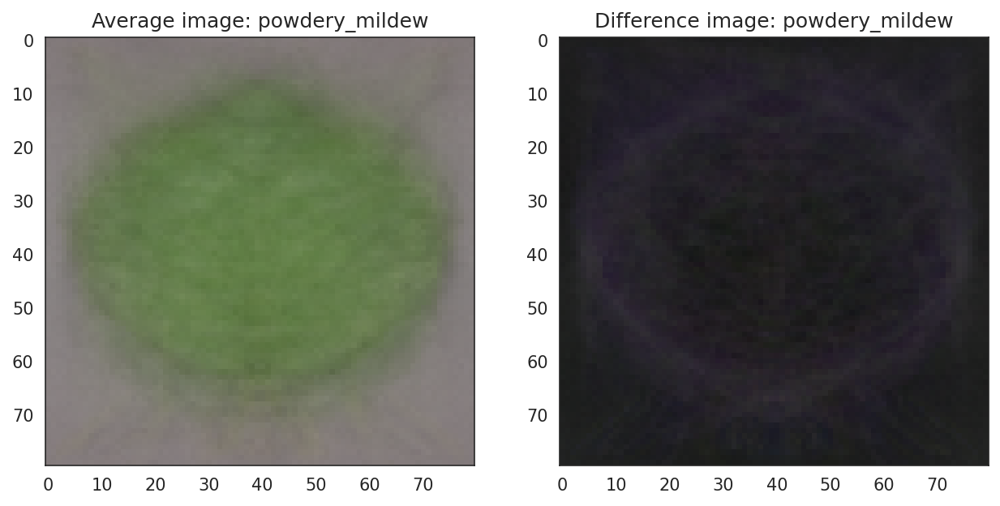
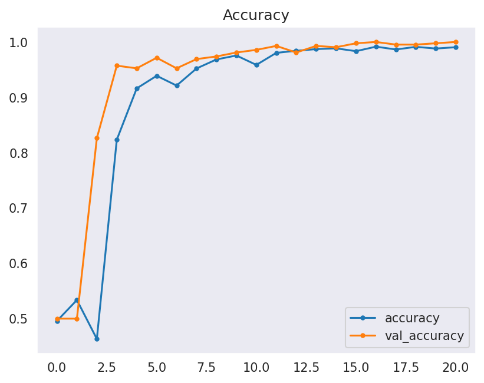

# Cherry Leaves Mildew Detection

The deployed app can be accessed [here](https://mildew-detection-bn-f2c139f5e8bd.herokuapp.com/)

## Introduction
Farmy & Foods have a mildew problem. Their cherry plantation operations have a growing powdery mildew issue. Powdery mildew, a fungal disease that affects many plant species, typically starts off as small white circular spots on the surface of leaves, and as the mildew progresses the spots may expand to cover the entire surface of each leaf. Infected leaves may become distorted, curl and fall from the tree. The disease deprives plants of water and nutrients, impacting their growth, blooming and development. 

The current system of manual inspection can take 30 minutes per tree, plus the time to apply treatment if necessary. Farmy & Foods' operation spans thousands of trees across multiple locations, rendering the manual process inadequate. 

With this in mind, a machine learning system has been proposed to detect powdery mildew in cherry leaf images, greatly increasing the speed of detection. All that will be needed is a photograph of a leaf from a tree and for that image to be fed into the ML model to discern whether powdery mildew is present.

## Dataset
The [dataset](https://www.kaggle.com/codeinstitute/cherry-leaves) input comprises of over 4200 cherry leaf images from Farmy & Foods, pre-labelled *healthy* [uninfected] or *powdery mildew* [infected with mildew]. 

## Business Case Assessment
### The business requirements are:
<ol><li> The client is interested in conducting a study to visually differentiate a cherry leaf that is healthy from one that is infected with powdery mildew.</li>
<ul><li>a. The client is interested in predicting if a cherry leaf is healthy or contains powdery mildew based on visual analysis.</li>
<li>b. A 97% degree of accuracy has been agreed.</li></ul>
<li> The client requires a dashboard to view the results. </li>
<li> The client provided the data under an NDA (non-disclosure agreement), therefore the data should only be shared with professionals that are officially involved in the project, for ethical and privacy reasons.</li></ol>

### The benefit for the client is:
- Manual checking - shown to be unscalable for an operation of this magnitude - will be minimised.
- They will be able to ensure that the product they supply to the market is not compromised.
- The spread of powdery mildew can be controlled with early diagnosis and treatment of infected plants.

### The data analyst will therefore:
- Use inputs of cherry leaf images known to be either healthy or infected with mildew to train an image analysis model.
- Use known data to train the model to be able to predict whether unknown images are infected or not.
- Conduct analysis on both average and variability images for both healthy and unhealthy leaves.
- There will be an image montage for each of the two classes.
- A binary classifier will be used to give a simple _healthy_/_infected_ [powdery_mildew] output, with a calculation of the prediction accuracy on each image. 

## Hypothesis and Validation:
- We can hypothesise that it's possible to visually differentiate between healthy and mildew infected leaves.
- As the data analyst, I believe it's possible to train an ML model to differentiate between healthy/mildew infected leaves through visual analysis of images at a greater than 97% accuracy rate.

The initial hypothesis can be confirmed by the fact that manual visual differentiation already occurs at Farmy & Foods (albeit at a slow and hard to scale level)

The second hypothesis was be tested through extensive training of an ML model with the aim of accurate differentiation of healthy/infected leaves at the highest possible accuracy rate. An accuracy rate of 99.7+% was reached with one of the models trained, and 99.6+% with the other. 

## Rationale to map Business requirements to Data Visualisations and ML tasks
~~

## Workflow

CRISP-DM (CRoss Industry Standard Process for Data Mining) is used as a rationale to map business requirements to the Data Visualisations and ML tasks. It has six phases:

- **Business Understanding**  
This means understanding the business requirements of the client (detailed above). Understanding the requirements is essential to the project.

- **Data Understanding**  
The data must be appropriate for addressing the task. Do we have enough images? If not, what sort of augmentation is necessary? Is the resolution good enough for a visual differentiation? Within the dataset are there non-image files? This sort of question is vital to understanding the resources you're working with.

- **Data Preparation**  
This addresses how the data will be organised for modelling. In this case the data is split into train, validation and test sets (70:10:20). Labels should be equally distributed in each set. Image augmentation will be run to create variations of the images to help reduce overfitting.

- **Modelling**  
The modelling techniques used must be decided upon. Binary classification makes sense as we're only looking at 2 classes. Both Softmax and Sigmoid models are able to parse binary classification. Two models will be created to test which model does it best before moving forward with the more accurate model for deployment. Within each model I will stack layers of filters within a CNN (Convolutional Neural Network), and tune hyperparameters to get the highest accuracy rating possible.

- **Evaluation**  
Model performance will be evaluated to see if it matches (or indeed exceeds) the business requirements. Dashboard design must also be evaluated to make sure it's simple and clear. All required functionality (e.g. image montage, live detection app) should be present and working.

- **Deployment**  
Once the project is evaluated and found to be ready for use, it will be deployed to Heroku for ease of access.

The modelling and evaluation stages were performed iteratively, testing, evaluating then re-modelling and testing.

## Dashboard design: 
The Streamlit dashboard contains 5 pages: ~~ screenshots

- ### Project summary page
The project is here briefly summarised for the reader or client

- ### Project hypothesis page
The main hypothesis is stated and brief information given on how it was validated.

- ### Visual differentiation page
This page contains information related to the Data Visualisation step of the project, showing a montage for healthy/mildew infected leaves on request, and average/difference images of both healthy and infected leaves.

- ### Live detection app page
Using the download link, the user can download the entire dataset used in training and testing the presented model. The user must then be able to upload single or multiple images, and for each image a prediction statement [healthy/unhealthy] plus the probability of correct prediction should be present. A downloadable table with the results must also be available.

- ### ML Performance Metrics page
Here the more technical aspects of the project will be discussed, including the preparation steps taken and how the models performed.

## Notebooks
The project contains 4 Jupyter notebooks.
- ### Data Collection
This notebook is where the dataset is downloaded from Kaggle, uploaded to GitPod, any non-image files removed and the images split into train, validation and test sets with a standard 70:10:20 ratio split. 

- ### Data Visualisation
Images are resized and put in an array for modelling. The image_shape.pkl is created. An image montage, plus average and difference images are produced for each label.

 
  
 

- ### Modelling and Evaluation 1 - Softmax model
The images go through an augmentation process, where the images are rotated, sheared, zoomed, flipped and rescaled in order to create a more random imageset that is harder for the model to memorise. The first model (using a Softmax activation) is created, tuned and tested to reach the highest accuracy level possible.  
The model is then evaluated on the test set data and the evaluation saved. 
The architecture and logic for the model is presented below.

- ### Modelling and Evaluation 2 - Sigmoid model
The images are again augmented, as before (the pre-augmented images cannot be used as a variable is required to be set differently for Sigmoid and Softmax models). A Sigmoid output model is then created, and then tuned by changing various hyperparameters to get the best accuracy possible. 
The model is then evaluated on the test set data and the evaluation saved. 
The architecture and logic for the model is presented below.

## Explanation and logical basis for models
### Softmax Activation Function Model
Softmax models are most often used for [multi-]categorical classification tasks where there are 3 or more categories to be distinguished between ('is this image a tree, lampost or traffic light', 'is this image a house, apartment or shed' etc). The model requires these classifications to be encoded as digits [0, 1, 2 etc] and the output is a probability of one of these digits, which we can then translate back into more easily understood language. Softmax models can, of course, also be used for binary classification tasks such as the project we're working on.   
The model starts off with a relatively simple input layer and increases in complexity through the model (filters increasing from 32 to 64 to 128). Kernel size is varied to search for features at differing resolutions. Max Pooling is set to (2,2) or (3,3) in early layers, but in the final 2 convolutional layers to (1,1), which has no effect on spatial dimensions, effectively scanning the entire image with no reduction in size.   
A small dropout layer is introduced after several layers (0.1 = 10%) to introduce randomness by randomly dropping a percentage of neurons. I was worried that with a relatively deep model there was a danger of overfitting, so thought it wise to include 2 dropout layers, albeit dropping out at a relatively low level (0.1 and 0.3).   
Activation on every layer was ReLu as through extensive testing it seemed to perform the best, but in the final convolutional layer I used a tanh layer to capture more nuanced patterns. Multiple different activation layers were tested, tanh and relu consistently gave the best results.  
A Flatten layer is then used to convert the 3D feature map into a 1D array to be fed into the fully-connected Dense layer, followed by the second dropout layer (0.3).  
The output layer was, of course, Softmax.   
The model was compiled with loss set to binary_crossentropy, optimizer set to Adam (Adaptive Moment Estimation), and the metrics as accuracy.  

I tested thoroughly with a categorical_crossentropy loss setting but couldn't replicate the accuracy from binary_crossentropy. Multiple optimizers were tested including RMSProp, SGD, Adagrad but Adam returned the best accuracy.   
As I had resized my images down to 80x80px the number of parameters was relatively small. Although there's no 'right' answer for how many parameters to aim for, I had seen models using anything from 400,000 to 2.7 million parameters. I thought it prudent to aim for a minimum of 500,000, and added convolutional layers until I felt I had a reasonable amount (ultimately, 679,554 parameters).  
The accuracy of the model (99.64%) tells me that I certainly had enough parameters to work with. It would be interesting to remove layers and test with a far lower number of parameters to see if I could maintain accuracy, though for this project I didn't have the time or need to do so once I'd hit such a high level of accuracy.  
Early stopping was set to 4 to stop the model once it wasn't improving any more, and epochs [cycles through the training data] were set to 30, although the model completed the fitting process after 21 epochs.

 

 

### Sigmoid Activation Function Model
Sigmoid models are more commonly used for binary classifcation tasks where the output is either category 1 or category 2 (dog or cat, cup or plate, healthy or unhealthy). Classification labels are encoded as digits [0, 1] and the single output is a probability between 0-1. Generally, the cut-off will be at 0.5 (halfway between) to decide if the model is predicting category A[0] or B[1]. The output is then mapped back onto the human-understandable labels.   
The model built in Modelling and Evaluation 2 consists of a very similar input layer to the Softmax model - 32 x 3 filters, the spatial dimensions reduced by half with a (2,2) Max Pooling size. There then follow 2 convolutional layers with 128 and then 64 filters, both with (3,3) kernel sizes and (2,2) Max Pooling sizes. Activation is relu throughout. 
A Flatten layer feeds into the Dense layer, and then there's a relatively large dropout layer (0.5) to reduce chance of overfitting.  
Naturally, loss is set to binary_crossentropy, the optimizer is set to Nadam and metrics to accuracy.     
I tested several optimizers (including RMSProp, SGD, Adam) for this model, and settled on Nadam (Nesterov-accelerated Adaptive Moment Estimation). none of the other optimizers were as accurate for me.   
Also included within the model is a learning rate scheduler. The idea was to have the model fine-tune its learning as it passed through the epochs after making relatively large updates to its parameters to get into the right ballpark for accuracy in the early epochs. An initial learning rate of 1e-3 [0.001] is fairly standard (not too large or small), and the learning rate scheduler reduced this rate by 10% after each 8 epochs, which means an exponential decrease after a looping through the 8 epoch set enough times.   
Early stopping was set to 5 to allow the to complete more cycles. I was confdent enough that the model would not overfit at this early stopping setting.
Epochs were set to 40, but the model completed its training in 28 epochs, where early stopping stepped in to conclude the fitting process.

 

 

## Model Performance
Both models performed well, and there was no evidence of overfitting (only able to accurately predict data from the training set) or underfitting (failure to learn).

A well-fitted model exhibits the following characteristics:

- The training loss curve stabilises over time.
- The validation loss curve also stabilises and remains close to the training loss curve.
- A minimal gap exists between the final loss/accuracy values of the training and validation datasets.

As can be seen, these criteria hold true for both models.

**Softmax model:** 
 
  

**Sigmoid model:** 
 
  

### Conclusion
Both models displayed a _**normal**_ fit with both accuracy and loss improving significantly during training. Validation set data closely mirrored training set data, and actually appeared to be more accurate than the training data in the Softmax model. Neither model exhibited evidence of overfitting. Accuracy was slightly better on the Sigmoid optimizer model, therefore this is the model used in live prediction in the app.

## User Stories
User stories were created using GitHub's kanban board. All user stories were satisfied before project deployment.  
[Link to Kanban board](https://github.com/users/caketaster/projects/5)

## Future Features
- I would like to augment the number of images in the dataset to see if performance improves.
- Image size was set to (80,80) for deployment purposes, images at the original (256,256) size would presumably allow for greater precision in diagnosis.
- Images were tested using full rgb, it would be interesting to see if the results would hold using grayscale - I'm unsure of how much influence the colours are having on detection.

## Deployment 
### Heroku

* The App live link is: [mildew-detection-bn](https://mildew-detection-bn-f2c139f5e8bd.herokuapp.com/ )
* Using the Heroku CLI, runtime was set to [Heroku-20](https://devcenter.heroku.com/articles/python-support#supported-runtimes) 
* The project was deployed to Heroku using the following steps.

1. Log in to Heroku and create a new App.
2. Give the app a unique name and select region.
3. At the Deploy tab, select GitHub as the deployment method.
4. Select the repository name (mildew-detection) and click Search. Once found, click Connect.
5. Select the Main branch to deploy.
6. Select _automatic deploy_ to allow the app to update automatically each time you git push.
7. Click Deploy Branch to build the app.
5. Click now the button Open App on the top of the page to access the App.

## Testing
- All Python pages (i.e. app pages) were passed to the [Code Institute Linter](https://pep8ci.herokuapp.com/) and passed with no errors (note: # noqa was called on occasion when the line could not be broken up).
- The Streamlit app was tested on Chrome, Edge and Firefox on desktop and laptop and worked perfectly on all.
- ~~ Fixed bugs

## Main Data Analysis and Machine Learning Libraries
### Languages used:
- [Python](https://www.python.org/doc/)

### IDE
- [GitPod](https://gitpod.io/workspaces)

### Repository
- [GitHub](https://github.com/)

### Notebook code environment
- [Jupyter notebooks](https://docs.jupyter.org/en/latest/)

### Dashboard
- [Streamlit](https://docs.streamlit.io/)

### Hosting
- [Heroku](https://www.heroku.com/)

### Dataset
- [Kaggle](https://www.kaggle.com/)

### Libraries and packages
- [Numpy](https://numpy.org/doc/) (numpy==1.19.2)
- [Pandas](https://pandas.pydata.org/docs/) (pandas==1.1.2)
- [Scikit-Learn](https://scikit-learn.org/stable/index.html) (scikit-learn==0.24.2)
- [Tensorflow](https://www.tensorflow.org/api_docs) (tensorflow-cpu==2.6.0)
- [Seaborn](https://seaborn.pydata.org/) (seaborn==0.11.0)
- [MatPlotLib](https://matplotlib.org/stable/index.html) (matplotlib==3.3.1)
- [Plotly](https://plotly.com/python/) (plotly==4.12.0)

## Credits 

~~ Not done yet
~~ Learning rate

* In this section, you need to reference where you got your content, media and from where you got extra help. It is common practice to use code from other repositories and tutorials. However, it is necessary to be very specific about these sources to avoid plagiarism. 
* You can break the credits section up into Content and Media, depending on what you have included in your project. 

The project was inspired largely by the Malaria Detection walkthrough project, and the basics of the code and layout of the project are similar.  

- The text for the Home page was taken from Wikipedia Article A.
- Instructions on how to implement form validation on the Sign-Up page were taken from [Specific YouTube Tutorial](https://www.youtube.com/).
- The icons in the footer were taken from [Font Awesome](https://fontawesome.com/).

- The photos used on the home and sign-up page are from This Open-Source site.
- The images used for the gallery page were taken from this other open-source site.

## Acknowledgements (optional)
* Thank the people that provided support throughout this project.

n.b.
## ML Business Case
* In the previous bullet, you potentially visualised an ML task to answer a business requirement. You should frame the business case using the method we covered in the course.

- need to check course materials

# TO DO
- screenshots of app
- fix confusion matrices for val sets
- remove redundant test matrix code
- raise gamma for diff images...?
- credits and acknowledgements
- do a bit of refactoring and add more notes to functions

Think: CRISP-DM, AGILE - justify decisions made using these frameworks
model: tested: adam, adagrad, SGD, Adadelta, Nadam, RMSProp

quote from video (re: base CI model for malaria detection): Convolution layers are used to select the dominant pixel value
from the non-dominant pixels in images using filters whereas the max-pooling layers reduce
the size of image by extracting only the dominant pixels within the pool size. This reduced image
only contains the dominant feature of the image. The combination of these two layers removes
the nonessential part of the image and reduces complexity, therefore providing more accuracy.
Here, in our model, we have used filters of a 3 by 3 matrix and their numbers are varied from
32 to 64, the pool size for the max-pooling layer is a 2 by 2 matrix. The input image shape in the
first convolution layer is served as the average image shape from the data visualization video.
As well as this, the flatten layer is used to flatten the matrix into a vector,
which means a single list of all values, and to
feed it into a dense layer. The dense layer then does the mathematical operation
and gives the output. In our model, we have used 128 nodes in one of our Dense layers,
and 1 node in the output dense layer, because we want single output at a time using the sigmoid
activation function. This output activation function defines the probabilistic result.
Finally, the Dropout layer is used in this network to drop 50 percent of the nodes
to avoid overfitting the model.
We use a combination of all these layers to develop a convolution neural network,
which we will use in the final prediction tasks.
The activation function in the output layer is sigmoid. The loss, optimizer,
and metrics used in the model compiler are binary cross-entropy, adam, and accuracy respectively.
These three hyperparameters along with the activation function of the output layer
which control the classification and regression problems.

tweaking: relu, adam, kernel_size, filters
> For binary classification, we use binary cross-entropy as the loss function,
*adam, rmspro, SGD or any other function as an optimizer* and accuracy as metrics, along
with sigmoid as an activation function in the output layer (1 node instead of the 2 needed for softmax).

Hyperparameters tune the model parameters so that we can control the performance of the model.
In our model, we have used dropout, loss, optimizer, and nodes in the dense layer as
the hyperparameter that can be tuned to control the model performance. However, *the selection
of the optimum hyperparameter value is a trial and error type method. Hence, we use different model
tuning functions present in the Keras packages.* I recommend reading more about hyperparameter
tuning in TensorFlow and Keras on your own and trying to tune models later to see their effect.
One more piece of information about convolution neural network performance tuning is that
*we use transfer learning techniques which are trained layers of neural networks. Read more
about transfer learning on Tensorflow and Keras documentation to learn more about this technology*.

------------------

## Codeanywhere Template Instructions

Welcome,

This is the Code Institute student template for Codeanywhere. We have preinstalled all of the tools you need to get started. It's perfectly ok to use this template as the basis for your project submissions. Click the `Use this template` button above to get started.

You can safely delete the Codeanywhere Template Instructions section of this README.md file,  and modify the remaining paragraphs for your own project. Please do read the Codeanywhere Template Instructions at least once, though! It contains some important information about the IDE and the extensions we use. 

## How to use this repo

1. Use this template to create your GitHub project repo

1. Log into <a href="https://app.codeanywhere.com/" target="_blank" rel="noreferrer">CodeAnywhere</a> with your GitHub account.

1. On your Dashboard, click on the New Workspace button

1. Paste in the URL you copied from GitHub earlier

1. Click Create

1. Wait for the workspace to open. This can take a few minutes.

1. Open a new terminal and <code>pip3 install -r requirements.txt</code>

1. In the terminal type <code>pip3 install jupyter</code>

1. In the terminal type <code>jupyter notebook --NotebookApp.token='' --NotebookApp.password=''</code> to start the jupyter server.

1. Open port 8888 preview or browser

1. Open the jupyter_notebooks directory in the jupyter webpage that has opened and click on the notebook you want to open.

1. Click the button Not Trusted and choose Trust.

Note that the kernel says Python 3. It inherits from the workspace so it will be Python-3.8.12 as installed by our template. To confirm this you can use <code>! python --version</code> in a notebook code cell.

## Cloud IDE Reminders

To log into the Heroku toolbelt CLI:

1. Log in to your Heroku account and go to *Account Settings* in the menu under your avatar.
2. Scroll down to the *API Key* and click *Reveal*
3. Copy the key
4. In the terminal, run `heroku_config`
5. Paste in your API key when asked

You can now use the `heroku` CLI program - try running `heroku apps` to confirm it works. This API key is unique and private to you, so do not share it. If you accidentally make it public then you can create a new one with _Regenerate API Key_.

## Dataset Content
* The dataset is sourced from [Kaggle](https://www.kaggle.com/codeinstitute/cherry-leaves). We then created a fictitious user story where predictive analytics can be applied in a real project in the workplace.
* The dataset contains +4 thousand images taken from the client's crop fields. The images show healthy cherry leaves and cherry leaves that have powdery mildew, a fungal disease that affects many plant species. The cherry plantation crop is one of the finest products in their portfolio, and the company is concerned about supplying the market with a compromised quality product.

## Business Requirements
The cherry plantation crop from Farmy & Foods is facing a challenge where their cherry plantations have been presenting powdery mildew. Currently, the process is manual verification if a given cherry tree contains powdery mildew. An employee spends around 30 minutes in each tree, taking a few samples of tree leaves and verifying visually if the leaf tree is healthy or has powdery mildew. If there is powdery mildew, the employee applies a specific compound to kill the fungus. The time spent applying this compound is 1 minute.  The company has thousands of cherry trees, located on multiple farms across the country. As a result, this manual process is not scalable due to the time spent in the manual process inspection.

To save time in this process, the IT team suggested an ML system that detects instantly, using a leaf tree image, if it is healthy or has powdery mildew. A similar manual process is in place for other crops for detecting pests, and if this initiative is successful, there is a realistic chance to replicate this project for all other crops. The dataset is a collection of cherry leaf images provided by Farmy & Foods, taken from their crops.

* 1 - The client is interested in conducting a study to visually differentiate a healthy cherry leaf from one with powdery mildew.
* 2 - The client is interested in predicting if a cherry leaf is healthy or contains powdery mildew.

## Hypothesis and how to validate?
* List here your project hypothesis(es) and how you envision validating it (them).

## The rationale to map the business requirements to the Data Visualisations and ML tasks
* List your business requirements and a rationale to map them to the Data Visualisations and ML tasks.

## ML Business Case
* In the previous bullet, you potentially visualised an ML task to answer a business requirement. You should frame the business case using the method we covered in the course.

## Dashboard Design
* List all dashboard pages and their content, either blocks of information or widgets, like buttons, checkboxes, images, or any other items, that your dashboard library supports.
* Finally, during the project development, you may revisit your dashboard plan to update a given feature (for example, at the beginning of the project, you were confident you would use a given plot to display an insight, but later, you chose another plot type).

## Unfixed Bugs
* You will need to mention unfixed bugs and why they were unfixed. This section should include shortcomings of the frameworks or technologies used. Although time can be a significant variable for consideration, paucity of time and difficulty understanding implementation is not a valid reason to leave bugs unfixed.

## Deployment
### Heroku

* The App live link is: https://YOUR_APP_NAME.herokuapp.com/ 
* Set the runtime.txt Python version to a [Heroku-20](https://devcenter.heroku.com/articles/python-support#supported-runtimes) stack currently supported version.
* The project was deployed to Heroku using the following steps.

1. Log in to Heroku and create an App
2. At the Deploy tab, select GitHub as the deployment method.
3. Select your repository name and click Search. Once it is found, click Connect.
4. Select the branch you want to deploy, then click Deploy Branch.
5. The deployment process should happen smoothly if all deployment files are fully functional. Click now the button Open App on the top of the page to access your App.
6. If the slug size is too large then add large files not required for the app to the .slugignore file. 

## Main Data Analysis and Machine Learning Libraries
* Here you should list the libraries used in the project and provide an example(s) of how you used these libraries.

## Credits 

* In this section, you need to reference where you got your content, media and from where you got extra help. It is common practice to use code from other repositories and tutorials. However, it is necessary to be very specific about these sources to avoid plagiarism. 
* You can break the credits section up into Content and Media, depending on what you have included in your project. 

### Content 

- The text for the Home page was taken from Wikipedia Article A.
- Instructions on how to implement form validation on the Sign-Up page were taken from [Specific YouTube Tutorial](https://www.youtube.com/).
- The icons in the footer were taken from [Font Awesome](https://fontawesome.com/).

### Media

- The photos used on the home and sign-up page are from This Open-Source site.
- The images used for the gallery page were taken from this other open-source site.

## Acknowledgements (optional)
* Thank the people that provided support throughout this project.
